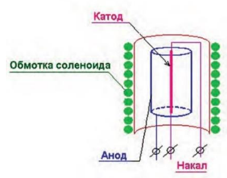

# Задача 1 «Магнетрон»

 

Внутри бесконечно длинного цилиндрического соленоида диаметром D, с числом витков на единицу длины n, установлен вакуумный диод с цилиндрическим анодом и катодом.
Радиусы анода и катода Ra и Rk соответственно. Оси диода и соленоида совпадают. При нагреве катода из него без начальной скорости вырываются электроны.
Между анодом и катодом приложена разность потенциалов U, которая может изменяться в диапазоне от U1 до U2. При каком токе в соленоиде Ic электрон будет описывать
окружность диаметром (Ra-Rk)?  

Построить траекторию движения электрона при заданном U и Ic.  

Построить диаграмму (Ic от U) на которой отметить область в которой электрон описывает окружность диаметром (Ra-Rk). Параметры должны задаваться.