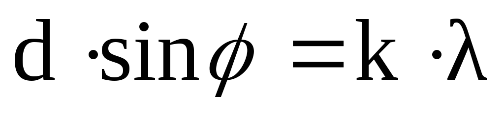
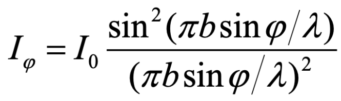

### Задаем параметры дифракционной решетки
period = 1.0  # период решетки   
total_strokes = 800  # общее число штрихов

- Период решетки - это расстояние между соседними штрихами (или отверстиями) на дифракционной решетке.

Период решетки влияет на углы, под которыми наблюдаются дифракционные максимумы. 
Углы дифракционных максимумов определяются формулой дифракции решетки:

1. d - Это период решетки
2. sin(phi) - синус угла дифракции. Угол дифракции - это угол между направлением входящего света
и направлением дифракционного максимума. 
3. k - порядок дифракционного максимума. 
4. lambda - длина волны

- Штрихи - это отверстия или прорези на решетке, через которые проходит свет.

Большее число штрихов обычно приводит к более яркому и четкому дифракционному паттерну.
Больше штрихов => больше путей, по которым свет может проходить
и интерферировать, создавая дифракционный паттерн.

``Intensity = np.sin(np.pi * total_strokes * period * np.sin(Theta) / Wavelength) ** 2 / \
            (np.sin(np.pi * period * np.sin(Theta) / Wavelength) ** 2)``

Количество штрихов, total_strokes, представляет собой число линий на дифракционной решетке.
Это количество критично, так как каждая линия на решетке служит источником вторичных волн,
что подтверждается принципом Гюйгенса. Падающий на решетку свет заставляет каждую линию
генерировать свою волну, и эти волны впоследствии интерферируют между собой, формируя дифракционный узор.

В формуле total_strokes умножается на np.sin(Theta) / Wavelength,что отражает фазовый
сдвиг между волнами от соседних линий. Далее применяется функция синуса к этому результату,
что соответствует принципу суперпозиции волн: волны суммируются в точках их встречи.

Таким образом, total_strokes влияет на общую интенсивность дифракционного паттерна. Большее
число штрихов приводит к большей общей интенсивности, так как больше штрихов генерирует больше
волн, которые могут интерферировать и создавать дифракционный паттерн. Это число можно изменить
в зависимости от ваших потребностей или специфики эксперимента.